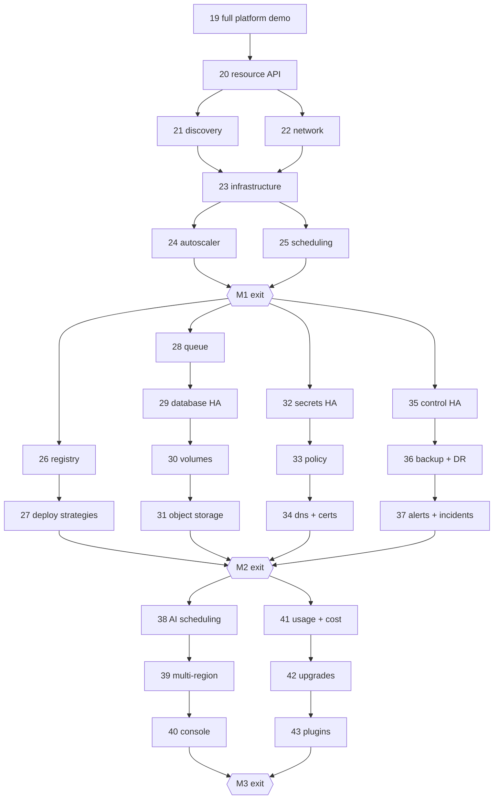

# Forge Platform — Future plan (epics 20–43)

Planning catalog for the **standalone cloud** phase, which begins after epic `19`.
Capability source of truth: [`docs/architecture/standalone-cloud.md`](../architecture/standalone-cloud.md).
Current-roadmap catalog (epics `00`–`19`): [`MASTER_PLAN.md`](MASTER_PLAN.md).

> **Epics `00`–`19` are being implemented right now (`N = 51`). Nothing in this document
> changes them.** Future work is strictly additive — see
> [ADR 0007](../decisions/0007-additive-evolution-after-epic-19.md).

**Do not implement from this file.** Implement one step at a time via
[`IMPLEMENT_STEP.md`](IMPLEMENT_STEP.md).

---

## 1. What changes after epic 19

Forge stops being a locally runnable developer platform and becomes a platform that runs
the same way on local Docker, bare metal, Hetzner, AWS EC2, and Azure VMs. Providers supply
primitives (machines, disks, networks, IPs, GPUs); Forge supplies everything above them.

Reference documents:

| Document | Covers |
|---|---|
| [standalone-cloud.md](../architecture/standalone-cloud.md) | target architecture, layering, milestones, cross-cutting requirements |
| [provider-model.md](../architecture/provider-model.md) | provider adapter interface, node pools, node lifecycle, install targets |
| [networking-and-discovery.md](../architecture/networking-and-discovery.md) | addressing, transports, discovery, node identity, network policy |
| [resource-model.md](../concepts/resource-model.md) | resource envelope, controllers, finalizers, events, audit |
| [application-manifest.md](../concepts/application-manifest.md) | customer-facing manifest and portability rules |
| [autoscaling-model.md](../concepts/autoscaling-model.md) | workload / worker / agent / node autoscaling and safeguards |

---

## 2. Milestones

| Milestone | Epics | Exit gate | Forge can then… |
|---|---|---|---|
| **M1 — Standalone cloud core** | `20`–`25` | `demos/25-ha-placement` + portability check | declarative resources, service discovery, multi-node network, infrastructure on any provider, workload + node autoscaling, workload recovery after node loss — same manifest on Docker, Hetzner, AWS, Azure |
| **M2 — Production platform** | `26`–`37` | `demos/37-incident-response` | registry, canary/blue-green deploys, durable queues, HA PostgreSQL, volumes, distributed object storage, HA secrets, policy, DNS + TLS, HA control plane, backups, incidents |
| **M3 — Global platform** | `38`–`43` | `demos/43-full-standalone-platform` | GPU/model scheduling, multi-region, console, usage and cost, self-upgrade, signed plugins |

---

## 3. Epic index

Planning depth: **Steps** = step files + `N` values exist; **Catalog** = step titles listed
in the epic doc, materialized later with [`PLAN_STEPS.md`](PLAN_STEPS.md).

| Epic | Title | Milestone | Extends | Gate demo | Depth |
|---|---|---|---|---|---|
| [20](epics/20-declarative-resource-api.md) | Declarative resource API | M1 | 02, 07 | `20-declarative-resources` | Steps (`132`–`139`) |
| [21](epics/21-forge-discovery.md) | Forge Discovery | M1 | 04, 05 | `21-service-discovery` | Steps (`140`–`145`) |
| [22](epics/22-forge-network.md) | Forge Network | M1 | 04, 08 | `22-forge-network` | Steps (`146`–`152`) |
| [23](epics/23-forge-infrastructure.md) | Forge Infrastructure | M1 | 04, 08 | `23-local-cloud-simulation` | Steps (`153`–`159`) |
| [24](epics/24-forge-autoscaler.md) | Forge Autoscaler | M1 | 07, 08, 12 | `24-autoscaling` | Steps (`160`–`167`) |
| [25](epics/25-scheduling-enhancements.md) | Scheduling enhancements | M1 | 08 | `25-ha-placement` | Steps (`168`–`173`) |
| [26](epics/26-forge-registry.md) | Forge Registry | M2 | 06 | `26-registry` | Catalog |
| [27](epics/27-deployment-strategies.md) | Deployment strategies | M2 | 07, 05 | `27-canary-rollout` | Catalog |
| [28](epics/28-forge-queue.md) | Forge Queue | M2 | 11 | `28-queue-autoscaling` | Catalog |
| [29](epics/29-database-high-availability.md) | Database high availability | M2 | 18 | `29-database-failover` | Catalog |
| [30](epics/30-forge-volumes.md) | Forge Volumes | M2 | 04, 23 | `30-persistent-volumes` | Catalog |
| [31](epics/31-distributed-object-storage.md) | Distributed object storage | M2 | 13 | `31-storage-repair` | Catalog |
| [32](epics/32-secrets-high-availability.md) | Secrets high availability | M2 | 10 | `32-secrets-ha` | Catalog |
| [33](epics/33-forge-policy.md) | Forge Policy | M2 | 02, 09 | `33-policy-admission` | Catalog |
| [34](epics/34-dns-and-certificates.md) | DNS and certificates | M2 | 05, 21, 22 | `34-domains-and-tls` | Catalog |
| [35](epics/35-control-plane-high-availability.md) | Control-plane high availability | M2 | 02, 07 | `35-control-failover` | Catalog |
| [36](epics/36-backup-and-disaster-recovery.md) | Backup and disaster recovery | M2 | 18, 13 | `36-disaster-recovery` | Catalog |
| [37](epics/37-alerts-and-incidents.md) | Alerts and incidents | M2 | 12, 15, 16 | `37-incident-response` | Catalog |
| [38](epics/38-ai-infrastructure-scheduling.md) | AI infrastructure scheduling | M3 | 14, 15, 24, 25 | `38-gpu-model-scaling` | Catalog |
| [39](epics/39-multi-region.md) | Multi-region | M3 | 21, 22, 23 | `39-multi-region` | Catalog |
| [40](epics/40-forge-console.md) | Forge Console | M3 | 20, 09 | `40-console` | Catalog |
| [41](epics/41-usage-quotas-and-cost.md) | Usage, quotas, and cost | M3 | 12, 23, 33 | `41-usage-and-cost` | Catalog |
| [42](epics/42-platform-upgrades.md) | Platform upgrades | M3 | 20, 35 | `42-platform-upgrade` | Catalog |
| [43](epics/43-plugins-and-extensions.md) | Plugins and extensions | M3 | 23, 34, 14 | `43-full-standalone-platform` | Catalog |

---

## 4. Dependency order

```text
20 Declarative resource API      ← foundation for every later kind
    ↓
21 Discovery ──┐
    ↓          │
22 Network ────┤
    ↓          │
23 Infrastructure
    ↓
24 Autoscaler ← 25 Scheduling enhancements
    ↓                    ↓
    └──── M1 exit ───────┘
    ↓
26 Registry → 27 Deployment strategies
28 Queue → 29 Database HA → 30 Volumes → 31 Object storage
32 Secrets HA → 33 Policy → 34 DNS + certificates
35 Control HA → 36 Backup + DR → 37 Alerts + incidents   ← M2 exit
    ↓
38 AI scheduling → 39 Multi-region → 40 Console
41 Usage + cost → 42 Upgrades → 43 Plugins               ← M3 exit
```



---

## 5. Demo map

Every future epic ends with an acceptance gate demo, invoked as `make demo DEMO=NN`.

| Demo path | Epic gate |
|---|---|
| `demos/20-declarative-resources` | `20.08` |
| `demos/21-service-discovery` | `21.06` |
| `demos/22-forge-network` | `22.07` |
| `demos/23-local-cloud-simulation` | `23.07` |
| `demos/24-autoscaling` | `24.08` |
| `demos/25-ha-placement` | `25.06` — **M1 exit** |
| `demos/26-registry` … `demos/36-disaster-recovery` | final step of each epic |
| `demos/37-incident-response` | final step of epic 37 — **M2 exit** |
| `demos/38-gpu-model-scaling` … `demos/42-platform-upgrade` | final step of each epic |
| `demos/43-full-standalone-platform` | final step of epic 43 — **M3 exit capstone** |

### Cloud-target demos

Optional demos run against real providers and are gated on an explicit environment
variable:

```bash
FORGE_DEMO_TARGET=hetzner make demo DEMO=23
FORGE_DEMO_TARGET=aws     make demo DEMO=23
```

They never run in CI and never gate a merge. The default target is always local Docker.

---

## 6. Reserved host ports

Extends [`docs/operations/ports.md`](../operations/ports.md).

| Service | Host port |
|---|---:|
| Forge Console (web UI) | 3010 |
| Forge Scheduler (if extracted) | 4108 |
| Forge Discovery | 4109 |
| Forge Network | 4110 |
| Forge Infrastructure | 4111 |
| Forge Autoscaler | 4112 |
| Forge Registry | 4113 |
| Forge Deploy | 4114 |
| Forge Queue | 4115 |
| Forge Data (database controller) | 4116 |
| Forge Volumes | 4117 |
| Forge Alerts | 4118 |
| Forge Backup | 4119 |
| Forge Policy | 4120 |
| Forge DNS (API; DNS itself on 5053/udp locally) | 4121 |
| Forge Certificates | 4122 |
| Forge Usage | 4123 |

---

## 7. Future execution queue

Continues the global `N` index. **Steps `1`–`131` are frozen**; the queue below is appended,
never renumbered. Full rows: [`STEPS.md`](STEPS.md#future-queue--standalone-cloud-epics-2025).

| N | Epic | Title |
|---:|---|---|
| 132–139 | 20 | resource envelope · generic CRUD · generation/status/conditions · labels + listing · watch + events · ownership + finalizers · compatibility facade + `forge apply` · demo |
| 140–145 | 21 | skeleton + registry model · endpoint leases · readiness selection + watch · internal DNS · Gateway integration · demo |
| 146–152 | 22 | skeleton + addressing · node identity + bootstrap · WireGuard peers · local/provider modes · network policy · overlay DNS · demo |
| 153–159 | 23 | provider interface + node pools · Docker provider · node bootstrap/join · SSH + bare metal · Hetzner · AWS + Azure · demo |
| 160–167 | 24 | skeleton + ScalingPolicy · CPU/memory · request rate + latency · queue depth · schedules + overrides · node scale-up · scale-down + safeguards · demo |
| 168–173 | 25 | requests/limits + capacity · labels/taints · affinity + topology spread · priority + preemption · GPU + stateful placement · demo |

**Total after M1 planning:** `N = 1` … `N = 173`. Epics `26`–`43` receive `N` values when
their steps are materialized.

---

## 8. Cross-cutting acceptance rules

Every future step must satisfy these before its gate passes:

1. **Additive** — names the shipped behaviour it preserves, and how.
2. **Idempotent** — external actions carry an operation id; retries produce no duplicates.
3. **Auditable** — every mutation records actor, action, resource, generations, request id,
   result.
4. **Portable** — demonstrable on local Docker; no provider-managed service required.
5. **Tenant-scoped** — organization → project → environment isolation holds on every axis
   the step touches.
6. **Observable** — health/readiness/liveness, structured logs, metrics, and traces, with
   named metric and span identifiers in the step doc.
7. **Recoverable** — behaviour after process restart and after node loss is stated and
   tested.
8. **Safe to delete** — finalizers defined; stateful resources are never cascade-deleted.

---

## 9. Open questions and assumptions

1. **Where does the resource store live?** *Assumption:* one generic `resources` table in
   the existing Control Postgres schema, with per-kind projections only where query load
   demands them. Revisit at epic 35 (multi-replica control plane).
2. **Watch transport.** *Assumption:* SSE, reusing the Gateway streaming support shipped in
   `05.06`; websockets only if a consumer needs bidirectional flow.
3. **Scheduler process boundary.** *Assumption:* stays a module inside Control through epic
   25, using the extract seam from `08.01`; extraction to port `4108` becomes worthwhile at
   epic 39 (multi-region).
4. **Autoscaler and Infrastructure as separate services.** *Assumption:* yes from the start —
   they have distinct failure domains and blast radii (ADR 0004).
5. **`forge.yaml` vs resource documents.** *Assumption:* both coexist; the build manifest
   from epic 06 stays valid and `forge apply` reads `forge.dev/v1` documents.
6. **WireGuard availability.** *Assumption:* kernel module when present, userspace
   implementation otherwise, so local demos always exercise the real path.
7. **Distributed storage engine (epics 30, 31).** *Assumption:* start with replication that
   Forge controls directly; adopting a packaged open-source engine under a Forge controller
   is an option evaluated at that epic, not a commitment now.
8. **Managed-service adapters.** *Assumption:* possible after M2, opt-in only, and never
   referenced by a product manifest.

---

## 10. Materialization checklist

| Artifact | Status |
|---|---|
| This `FUTURE_PLAN.md` | Done |
| `epics/20`–`43` docs | Done (Status: Planning) |
| `steps/20`–`25` step files (`N = 132`–`173`) | Done |
| `steps/26`–`43` step files | Deferred — materialize with `PLAN_STEPS.md` at M1 exit |
| `STEPS.md` future queue section | Done |
| `progress.md` future sections | Done |
| Architecture / concepts / ADR docs | Done |

**Current work is unchanged: next implementable step remains `N = 50`.**
