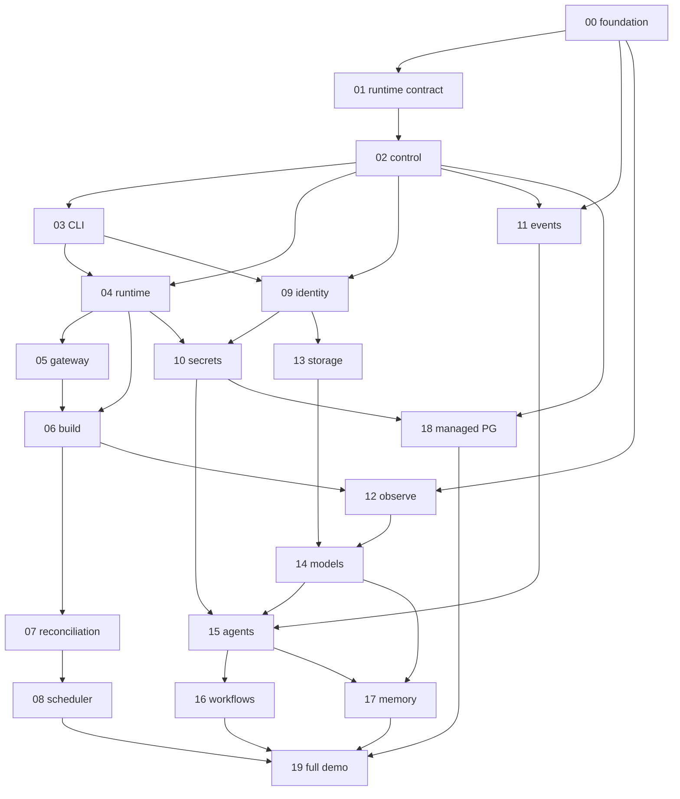

# Forge Platform — Master implementation plan

Planning-only catalog of **atomic steps** from the first unfinished step through the full-ecosystem capstone. Source of truth for capabilities: repository root [`specs.md`](../../specs.md). Process: [`PLAN_STEPS.md`](PLAN_STEPS.md) + [`IMPLEMENT_STEP.md`](IMPLEMENT_STEP.md).

**Planning status:** Epics `00` complete; `01` planned; `02`–`19` planned in this document and materialized under `epics/` + `steps/`.

**Do not implement application code from this file alone** — implement one step at a time via `IMPLEMENT_STEP.md`.

---

## North-star checklist (“100% working”)

When every step below is **Complete** and green:

| # | Outcome | Owned by (demo / step) |
|---|---|---|
| 1 | Local platform boots via Compose (`make setup && make dev` / equivalent `make up`) | `00` foundation + each service Compose wiring |
| 2 | All platform services healthy: control, runtime, gateway, build, identity, secrets, events, observe, storage, models, agents, workflows, memory (+ managed Postgres capability) | Epics `02`–`18` |
| 3 | Runtime contract enforced for Go, Kotlin, Rust, Python, Elixir | Epic `01` → `make demo DEMO=01` |
| 4 | CLI happy path (`specs.md` §1 / §14): project → service → database → secret → model → agent → deploy → status → logs | Control + CLI + later feature steps; verified in demos `03`, `10`, `14`, `15`, `18`, `19` |
| 5 | Per-epic demos `02`–`18` pass; capstone `demos/09-full-platform` passes | Each epic’s final step + epic `19` |
| 6 | Contracts (OpenAPI / events / env) documented and tested | Early steps in each service epic + `01.01` |
| 7 | Observability, identity, secrets, events, storage, AI, workflows, memory integrate in full-platform demo | Epics `09`–`17` + `19` |

### Demo ownership map

Prefer **§8 epic demo paths** for intermediate acceptance. Capstone uses **§3 / north-star** name `demos/09-full-platform` (see Open questions).

| Demo path | Epic / step gate |
|---|---|
| `demos/00-foundation` | `00.01` (done) |
| `demos/01-container-runtime` | `01.07` |
| `demos/02-control-plane` | `02.08` |
| `demos/03-cli-control` | `03.06` |
| `demos/04-runtime` | `04.08` |
| `demos/05-routed-service` | `05.07` |
| `demos/06-source-to-deployment` | `06.07` |
| `demos/07-rolling-deployment` | `07.06` |
| `demos/08-multi-node` | `08.06` |
| `demos/09-platform-identity` | `09.08` |
| `demos/10-secrets` | `10.07` |
| `demos/11-event-driven` | `11.07` |
| `demos/12-observability` | `12.07` |
| `demos/13-object-storage` | `13.07` |
| `demos/14-model-serving` | `14.07` |
| `demos/15-agent-runtime` | `15.08` |
| `demos/16-agent-workflow` | `16.07` |
| `demos/17-agent-memory` | `17.06` |
| `demos/18-managed-database` | `18.06` |
| `demos/09-full-platform` | `19.06` (capstone; thematic ID `09`) |

### CLI command → first owning step

| CLI (vision / §14) | First owning step | Notes |
|---|---|---|
| `forge login` | `09.07` | Identity; stub “dev token” optional earlier for local |
| `forge project create\|list` | `03.02` | Against Control `02.03` |
| `forge app create` | `03.02` | |
| `forge service create` | `03.02` | |
| `forge deployment create\|status` | `03.03` | |
| `forge config set\|show` | `03.04` / `10.05` | Config profiles early; platform config in Secrets epic |
| `forge secret set\|list\|rotate` | `10.05` | |
| `forge database create\|attach` | `18.06` (+ Control APIs in `18.01`–`18.03`) | |
| `forge model enable` / model calls | `14.07` (+ CLI thin client in `14.06` or `03` extension) | |
| `forge agent deploy\|run` | `15.07` / `15.08` | |
| `forge deploy` | `06.07` / `04.08` | Source-to-deploy after Build; image deploy after Runtime |
| `forge status` | `03.03` | Enriched by Runtime/Reconciler later |
| `forge logs --follow` | `04.05` (runtime) + `12.05` (observe) | |
| `forge workflow run` | `16.07` | |
| `forge agent run deployment-investigator` | `15.08` | |

---

## Epic order + dependency DAG

```text
00 Repository foundation (complete)
    ↓
01 Runtime contract (planned; implement next)
    ↓
02 Forge Control ─────────────┐
    ↓                         │
03 Forge CLI  ← Control API   │
    ↓                         │
04 Forge Runtime ← Control desired state
    ↓
05 Forge Gateway ← Control endpoints + Runtime ports
    ↓
06 Forge Build ← Registry + Control + Runtime/Gateway path
    ↓
07 Deployment reconciliation ← Control + Runtime (+ Gateway for traffic shift)
    ↓
08 Multi-node scheduler ← Control + multiple Runtime agents + Reconciler
    ↓
09 Forge Identity ← Control authz + CLI login
    ↓
10 Forge Secrets ← Identity (project scope) + Runtime injection
    ↓
11 Forge Events ← NATS (00) + producers/consumers across platform
    ↓
12 Forge Observe ← OTEL stack (00) + instrumented services
    ↓
13 Forge Storage ← Identity project isolation
    ↓
14 Forge Models ← Observe metrics; optional Storage for artifacts
    ↓
15 Forge Agents ← Models + Control/Runtime/Observe/Storage/Events tools + Identity
    ↓
16 Forge Workflows ← Events + Agents + Control rollback hooks
    ↓
17 Forge Memory ← Models embeddings + Agents + Identity ACL
    ↓
18 Managed PostgreSQL ← Control + Secrets injection + Runtime
    ↓
19 Full platform demo ← all of the above
```



---

## Assumed host port map (planning)

Recorded here so service steps stay consistent; finalize in `docs/operations/ports.md` during first service skeleton of each epic.

| Service | Host port | Range |
|---|---:|---|
| forge-gateway | 4000 | public |
| forge-control | 4001 | public |
| forge-identity | 4002 | public |
| forge-runtime | 4102 | internal |
| forge-build | 4103 | internal |
| forge-secrets | 4104 | internal |
| forge-events | 4105 | internal |
| forge-observe | 4106 | internal |
| forge-storage | 4107 | internal |
| forge-scheduler (if separate process) | 4108 | internal |
| forge-models | 4300 | AI |
| forge-agents | 4301 | AI |
| forge-workflows | 4302 | AI |
| forge-memory | 4303 | AI |
| Demo apps (epic 01) | 4201–4205 | demos |

---

## Epic catalogs (02–19)

Epic `01` is already planned (`01.01`–`01.07`); listed in the global queue for completeness. Refine only if wrong — do not restyle.

### Epic 01 — Runtime contract *(already planned)*

**Goal:** Language-agnostic container contract + five demos + shared validator.

| Step | Purpose |
|---|---|
| 01.01 | Document runtime contract + OpenAPI + log schema |
| 01.02 | Shared contract test runner |
| 01.03 | Go demo app + demo 01 scaffold |
| 01.04 | Python demo app |
| 01.05 | Kotlin demo app |
| 01.06 | Rust demo app |
| 01.07 | Elixir demo + full suite gate |

**Early verification:** `make demo DEMO=01` after `01.07`.  
**Cross-epic deps:** `00` complete.

---

### Epic 02 — Forge Control

**Goal:** Central control-plane API and source of truth for projects, apps, services, and desired deployments (no container execution yet).

| Step | Purpose |
|---|---|
| 02.01 | Service skeleton: Kotlin/Ktor module, Makefile, Dockerfile, health, Compose, ports |
| 02.02 | Domain model + Postgres migrations for Project/Environment/Application/Service/Deployment |
| 02.03 | Projects & environments read/write API |
| 02.04 | Applications & services API with relationship validation |
| 02.05 | Deployments (desired state) API + basic audit records |
| 02.06 | Shared error format, OpenAPI, contract tests, idempotency on creates |
| 02.07 | Structured logs + OTEL instrumentation for Control |
| 02.08 | Demo `02-control-plane` + epic acceptance gate |

**Early verification:** After `02.03`, curl create/list project; after `02.08`, full hierarchy demo.  
**Cross-epic deps:** `01` contract conventions for health/logs; Postgres from `00`.

---

### Epic 03 — Forge CLI

**Goal:** Thin Go CLI over Control API for the developer happy path (no direct DB access).

| Step | Purpose |
|---|---|
| 03.01 | CLI skeleton, profiles, endpoint config, global flags |
| 03.02 | `project` / `app` / `service` commands |
| 03.03 | `deployment create|status` commands |
| 03.04 | Table/JSON output, exit codes, timeouts, request ID surfacing |
| 03.05 | Shell completion + non-interactive mode hardening |
| 03.06 | Demo `03-cli-control` + epic acceptance gate |

**Early verification:** `forge project create` against local Control after `03.02`.  
**Cross-epic deps:** Control APIs from `02.03`–`02.05` (minimum `02.05` for deployment commands).

---

### Epic 04 — Forge Runtime

**Goal:** Single-node container runtime (Docker Engine) that materializes desired workloads and reports actual state.

| Step | Purpose |
|---|---|
| 04.01 | Service skeleton: Rust module, health, Compose, Docker socket access |
| 04.02 | Node identity + registration/heartbeat API (local node) |
| 04.03 | Workload create/start: pull image, env inject, port map, deterministic names/labels |
| 04.04 | Health probing of workloads + status model |
| 04.05 | Log streaming API for a workload |
| 04.06 | Stop/delete workload; no duplicate containers on retry |
| 04.07 | Control integration: accept deploy intent / report actual state |
| 04.08 | Demo `04-runtime` (deploy Go demo image) + epic gate |

**Early verification:** After `04.03`, start a known image via Runtime API; after `04.08`, CLI→Control→Runtime path.  
**Cross-epic deps:** Control deployment read models (`02.05`); Go demo image from `01.03`; CLI optional for demo (`03.03`).

---

### Epic 05 — Forge Gateway

**Goal:** Stable host/path HTTP routes to Runtime-published endpoints without clients knowing random ports.

| Step | Purpose |
|---|---|
| 05.01 | Service skeleton: Go reverse-proxy baseline, health, Compose |
| 05.02 | Static/dynamic route table + reverse proxy core |
| 05.03 | Sync routes from Control endpoint/read models |
| 05.04 | Health-aware upstream selection (skip unready) |
| 05.05 | Request IDs, forwarded headers, timeouts |
| 05.06 | WebSocket + SSE proxy support |
| 05.07 | Demo `05-routed-service` (multi-language hostnames) + epic gate |

**Early verification:** After `05.02`, curl through gateway to a fixed upstream; after `05.07`, `*.demo.localhost` hosts.  
**Cross-epic deps:** Runtime published ports (`04.04`); Control endpoint data (`02.05`/`04.07`).

---

### Epic 06 — Forge Build

**Goal:** Git → Docker build → local registry → deployable image metadata for Control/Runtime.

| Step | Purpose |
|---|---|
| 06.01 | Service skeleton: Go module, health, Compose, Docker + workspace volume |
| 06.02 | `forge.yaml` schema + build job OpenAPI |
| 06.03 | Clone/checkout + `docker build` with streamed logs |
| 06.04 | Tag (commit/build IDs) + push to local registry |
| 06.05 | Build status API + failure paths (no deploy on fail) |
| 06.06 | Control integration: create build → record image ref on service |
| 06.07 | Demo `06-source-to-deployment` (fixture repo → Gateway) + epic gate |

**Early verification:** After `06.04`, image appears in `localhost:5000`; after `06.07`, end-to-end source deploy.  
**Cross-epic deps:** Registry (`00`); Control (`02`); Runtime (`04`); Gateway (`05`) for final access.

---

### Epic 07 — Deployment reconciliation

**Goal:** Continuously reconcile desired vs actual replicas with rolling deploy and automatic rollback.

| Step | Purpose |
|---|---|
| 07.01 | Desired/actual replica model + controller skeleton in Control |
| 07.02 | Single-replica reconcile loop (converge create/stop) |
| 07.03 | Rolling update: start new → wait ready → shift → stop old |
| 07.04 | Unhealthy rollout → automatic rollback |
| 07.05 | Deployment history + controller restart safety |
| 07.06 | Demo `07-rolling-deployment` + epic gate |

**Early verification:** After `07.02`, kill container → controller recreates; after `07.06`, v1→v2 and bad v3 rollback.  
**Cross-epic deps:** Runtime (`04`); Gateway traffic shift (`05`); Control desired state (`02.05`).

---

### Epic 08 — Multi-node scheduler

**Goal:** Place workloads across multiple Runtime agents with capacity, affinity rules, and reschedule on node loss.

| Step | Purpose |
|---|---|
| 08.01 | Scheduler module/service skeleton + placement APIs |
| 08.02 | Multi-node registration, heartbeat, resource reporting |
| 08.03 | First-fit and least-allocated placement strategies |
| 08.04 | Anti-affinity + pending queue when cluster overloaded |
| 08.05 | Reschedule on node offline / lost workloads |
| 08.06 | Demo `08-multi-node` + epic gate |

**Early verification:** After `08.03`, 4 replicas across 2 simulated agents; after `08.06`, stop agent → reschedule.  
**Cross-epic deps:** Runtime node APIs (`04.02`); Reconciler (`07.02`+).

---

### Epic 09 — Forge Identity

**Goal:** Users, orgs, roles, API tokens, and service accounts; enforce authz on Control mutations.

| Step | Purpose |
|---|---|
| 09.01 | Service skeleton: Kotlin/Ktor, health, Compose, Postgres schema home |
| 09.02 | Users, organizations, memberships persistence |
| 09.03 | Registration, login, sessions |
| 09.04 | Roles (`organization-owner` … `viewer`) + project membership |
| 09.05 | API tokens + service accounts + revocation |
| 09.06 | Control authz middleware (reject unauthenticated mutations) |
| 09.07 | CLI `forge login` + token profile storage |
| 09.08 | Demo `09-platform-identity` + epic gate |

**Early verification:** After `09.03`, login returns session; after `09.08`, viewer cannot deploy.  
**Cross-epic deps:** Control (`02`); CLI (`03`). Local-dev bypass flag allowed until `09.06` for earlier demos — document as temporary.

---

### Epic 10 — Forge Secrets

**Goal:** Encrypted project/env secrets and config; inject into Runtime workloads; mask in logs.

| Step | Purpose |
|---|---|
| 10.01 | Service skeleton: Rust, health, Compose, encryption key bootstrap |
| 10.02 | Encrypted secret store + key versioning + metadata APIs |
| 10.03 | Config (non-secret) vs secrets APIs; project isolation |
| 10.04 | Runtime delivery/injection of secrets at deploy time |
| 10.05 | CLI `forge secret` / `forge config` commands |
| 10.06 | Access audit + log masking conventions |
| 10.07 | Demo `10-secrets` + epic gate |

**Early verification:** After `10.02`, set/get metadata without plaintext list; after `10.07`, rotate + redeploy.  
**Cross-epic deps:** Identity project scope (`09.04`); Runtime env inject (`04.03`).

---

### Epic 11 — Forge Events

**Goal:** Durable publish/subscribe and jobs over NATS with schemas, retries, and DLQ.

| Step | Purpose |
|---|---|
| 11.01 | Service skeleton: Go, NATS JetStream wiring, health, Compose |
| 11.02 | Publish + subscribe HTTP/gRPC (or HTTP) API |
| 11.03 | Durable consumers, ack, retry policy |
| 11.04 | Dead-letter queue + inspect APIs |
| 11.05 | Event JSON Schemas for platform types (`build.*`, `deployment.*`, …) |
| 11.06 | Idempotency keys + consumer identity |
| 11.07 | Demo `11-event-driven` (Go producer → Elixir consumer) + epic gate |

**Early verification:** After `11.03`, message survives consumer restart; after `11.07`, DLQ path proven.  
**Cross-epic deps:** NATS (`00`); polyglot consumer can be demo-only (Elixir from `01` patterns).

---

### Epic 12 — Forge Observe

**Goal:** Unified logs/metrics/traces UX on top of the foundation OTEL stack; CLI log tail; dashboards.

| Step | Purpose |
|---|---|
| 12.01 | Observe service skeleton + correlation APIs design |
| 12.02 | Platform instrumentation checklist applied to Control/Runtime/Gateway/Build |
| 12.03 | Grafana dashboards for platform/service/deployment/runtime |
| 12.04 | Log query/filter by project/deployment + request/trace ID |
| 12.05 | CLI `forge logs --follow` via Observe/Runtime |
| 12.06 | Basic alert rules (service down / error rate) |
| 12.07 | Demo `12-observability` (one distributed trace) + epic gate |

**Early verification:** After `12.02`, traces appear in Tempo; after `12.07`, CLI→…→app single trace.  
**Cross-epic deps:** OTEL/Grafana (`00`); instrumented path through `06` demo flow.

---

### Epic 13 — Forge Storage

**Goal:** Project-scoped object storage with streaming I/O, checksums, range requests, signed URLs.

| Step | Purpose |
|---|---|
| 13.01 | Service skeleton: Rust, local FS backend, health, Compose |
| 13.02 | Buckets + object metadata model + project isolation |
| 13.03 | Streamed upload/download (no full in-memory large files) |
| 13.04 | SHA-256 integrity + range requests |
| 13.05 | Signed access tokens + expiry enforcement |
| 13.06 | Quotas + delete + restart durability |
| 13.07 | Demo `13-object-storage` + epic gate |

**Early verification:** After `13.03`, upload/download round-trip; after `13.07`, expired token rejected.  
**Cross-epic deps:** Identity project context (`09`); used later by Build/Agents/Memory.

---

### Epic 14 — Forge Models

**Goal:** Unified model-serving API with at least one local backend (embeddings + generate/classify/summarize).

| Step | Purpose |
|---|---|
| 14.01 | Service skeleton: Python, health, Compose, port 4300 |
| 14.02 | Model registry + `GET /v1/models` |
| 14.03 | Local embeddings adapter (no external API required) |
| 14.04 | Generate / classify / summarize endpoints |
| 14.05 | Streaming responses + async job mode |
| 14.06 | Usage metrics + OpenAPI; optional CLI `forge model` |
| 14.07 | Demo `14-model-serving` + epic gate |

**Early verification:** After `14.03`, embed fixture text; after `14.07`, Go client uses all three capabilities.  
**Cross-epic deps:** Observe for usage (`12`); Storage optional for model files.

---

### Epic 15 — Forge Agents

**Goal:** Permission-aware agent runtime with tool registry, limits, audit, and human approval for destructive actions.

| Step | Purpose |
|---|---|
| 15.01 | Service skeleton: Python, health, Compose |
| 15.02 | Agent registry + YAML definition loading |
| 15.03 | Tool registry with per-call permission checks |
| 15.04 | Run execution engine: max steps, timeouts, history |
| 15.05 | Platform tools: Control/Runtime/Observe/Storage/Models/Events |
| 15.06 | Human approval gate for destructive tools (e.g. restart) |
| 15.07 | Seed agents (investigator, log summarizer, …) + CLI `forge agent` |
| 15.08 | Demo `15-agent-runtime` + epic gate |

**Early verification:** After `15.04`, dry-run agent with mock tools; after `15.08`, failing deploy diagnosed without unauthorized restart.  
**Cross-epic deps:** Models (`14`); Identity (`09`); Control/Runtime/Observe (`02`/`04`/`12`); Events (`11`).

---

### Epic 16 — Forge Workflows

**Goal:** Durable multi-step orchestration (Elixir) with retries, approvals, agent steps, and compensation.

| Step | Purpose |
|---|---|
| 16.01 | Service skeleton: Elixir/OTP, health, Compose |
| 16.02 | Workflow definitions + durable run state |
| 16.03 | Step primitives: retry, delay, timeout, parallel, conditional |
| 16.04 | Event triggers + agent step integration |
| 16.05 | Human approval persistence across restarts |
| 16.06 | Compensation/rollback steps wired to Control |
| 16.07 | Demo `16-agent-workflow` + epic gate |

**Early verification:** After `16.02`, restart service mid-run → resume; after `16.07`, failure→diagnose→approve→rollback.  
**Cross-epic deps:** Events (`11`); Agents (`15`); Control rollback (`07`).

---

### Epic 17 — Forge Memory

**Goal:** Semantic vector memory with project namespaces for agents and products (brute-force cosine first).

| Step | Purpose |
|---|---|
| 17.01 | Service skeleton: Rust, health, Compose, persistence dir |
| 17.02 | Collections + fixed-dimension vectors + metadata |
| 17.03 | Upsert + nearest-neighbor query (cosine) |
| 17.04 | Namespace/ACL filters via Identity project scope |
| 17.05 | Models embed integration + Agents retrieval tool |
| 17.06 | Demo `17-agent-memory` + epic gate |

**Early verification:** After `17.03`, NN on fixtures; after `17.06`, agent cites similar incidents.  
**Cross-epic deps:** Models (`14.03`); Agents (`15.05`); Identity (`09`).

---

### Epic 18 — Managed PostgreSQL

**Goal:** Product-facing managed Postgres provisioning (management plane): create, attach, inject URL, backup/restore, rotate.

| Step | Purpose |
|---|---|
| 18.01 | Control APIs + provisioner skeleton for DB instances |
| 18.02 | Create instance/database/credentials (isolated) |
| 18.03 | Attach to application + Secrets/Runtime URL injection |
| 18.04 | Backup + restore flows |
| 18.05 | Credential rotation + deletion protection |
| 18.06 | CLI `forge database *` + demo `18-managed-database` + epic gate |

**Early verification:** After `18.03`, app receives `DATABASE_URL` without hardcoded secrets; after `18.06`, backup/restore fixture.  
**Cross-epic deps:** Control (`02`); Secrets (`10`); Runtime (`04`); platform Postgres patterns from `00` (separate product instances — assumption below).

---

### Epic 19 — Full platform demo

**Goal:** Capstone polyglot product using the entire Forge stack; broken release auto-detected, diagnosed, approved, rolled back.

| Step | Purpose |
|---|---|
| 19.01 | Polyglot sample product scaffold (Go/Kotlin/Rust/Python/Elixir services) |
| 19.02 | Deploy path: Build → Runtime → Gateway → Events wiring for the product |
| 19.03 | Identity, Secrets, Observe, Storage, managed DB attached to product |
| 19.04 | Models + Agents + Memory wired for incident diagnosis |
| 19.05 | Failure injection + Workflows approval/rollback scenario |
| 19.06 | `demos/09-full-platform` acceptance suite + docs hardening (north-star gate) |

**Early verification:** After `19.02`, product reachable via Gateway; after `19.06`, one-command acceptance of recovery scenario.  
**Cross-epic deps:** All prior epics sufficiently complete (minimum capabilities named in step deps).

---

## Global execution queue

Single ordered list from first unfinished step → capstone. Implement strictly in this order unless a step’s dependencies allow safe parallelization of *planning* only.

1. `01.01` ← **implement next**
2. `01.02`
3. `01.03`
4. `01.04`
5. `01.05`
6. `01.06`
7. `01.07`
8. `02.01`
9. `02.02`
10. `02.03`
11. `02.04`
12. `02.05`
13. `02.06`
14. `02.07`
15. `02.08`
16. `03.01`
17. `03.02`
18. `03.03`
19. `03.04`
20. `03.05`
21. `03.06`
22. `04.01`
23. `04.02`
24. `04.03`
25. `04.04`
26. `04.05`
27. `04.06`
28. `04.07`
29. `04.08`
30. `05.01`
31. `05.02`
32. `05.03`
33. `05.04`
34. `05.05`
35. `05.06`
36. `05.07`
37. `06.01`
38. `06.02`
39. `06.03`
40. `06.04`
41. `06.05`
42. `06.06`
43. `06.07`
44. `07.01`
45. `07.02`
46. `07.03`
47. `07.04`
48. `07.05`
49. `07.06`
50. `08.01`
51. `08.02`
52. `08.03`
53. `08.04`
54. `08.05`
55. `08.06`
56. `09.01`
57. `09.02`
58. `09.03`
59. `09.04`
60. `09.05`
61. `09.06`
62. `09.07`
63. `09.08`
64. `10.01`
65. `10.02`
66. `10.03`
67. `10.04`
68. `10.05`
69. `10.06`
70. `10.07`
71. `11.01`
72. `11.02`
73. `11.03`
74. `11.04`
75. `11.05`
76. `11.06`
77. `11.07`
78. `12.01`
79. `12.02`
80. `12.03`
81. `12.04`
82. `12.05`
83. `12.06`
84. `12.07`
85. `13.01`
86. `13.02`
87. `13.03`
88. `13.04`
89. `13.05`
90. `13.06`
91. `13.07`
92. `14.01`
93. `14.02`
94. `14.03`
95. `14.04`
96. `14.05`
97. `14.06`
98. `14.07`
99. `15.01`
100. `15.02`
101. `15.03`
102. `15.04`
103. `15.05`
104. `15.06`
105. `15.07`
106. `15.08`
107. `16.01`
108. `16.02`
109. `16.03`
110. `16.04`
111. `16.05`
112. `16.06`
113. `16.07`
114. `17.01`
115. `17.02`
116. `17.03`
117. `17.04`
118. `17.05`
119. `17.06`
120. `18.01`
121. `18.02`
122. `18.03`
123. `18.04`
124. `18.05`
125. `18.06`
126. `19.01`
127. `19.02`
128. `19.03`
129. `19.04`
130. `19.05`
131. `19.06`

**Totals:** 20 epics (`00`–`19`); **atomic steps in queue:** 7 (`01`) + 124 (`02`–`19`) = **131 unfinished planned steps** + `00.01` complete = **132 step docs** when materialized.

Step counts per epic `02`–`19`: 8, 6, 8, 7, 7, 6, 6, 8, 7, 7, 7, 7, 7, 8, 7, 6, 6, 6 (all within 4–12; none <3).

---

## Open questions / assumptions

### Must acknowledge before coding (non-blocking for planning)

1. **Demo numbering (§3 vs §8):** Specs §3 lists thematic demos `01`–`09` (capstone `09-full-platform`); §8 names `demos/02-control-plane` … `demos/18-managed-database`. **Assumption:** Use §8 paths for epic demos; use `demos/09-full-platform` for epic `19` capstone (north-star). Do not rename epic `09` Identity demo — it stays `demos/09-platform-identity`.
2. **Auth before Identity:** Demos `02`–`08` may use a documented local-dev auth bypass on Control until `09.06`. **Assumption:** Bypass is compile-time/env `FORGE_AUTH_MODE=dev` and removed from default in Identity epic.
3. **Scheduler process boundary:** Spec allows separate Go service or Control module. **Assumption:** Start as module/package under Control in `08.01` with clear extract seam; optional separate binary if size demands.
4. **Managed Postgres isolation:** **Assumption:** Product DB instances are separate Postgres containers (or databases+roles on a dedicated “managed” Postgres) — not the platform Control database. Exact mechanism chosen in `18.01`.
5. **Models “local” backend:** **Assumption:** Tiny on-device/fixture model or deterministic stub embeddings acceptable for CI; real small HF model optional for local demos.
6. **WebSocket/SSE in Gateway (`05.06`):** Keep as its own step; if timeboxed, acceptance can be contract tests + one echo upstream.
7. **Make target `make up`:** Spec emphasizes `make dev`. **Assumption:** `make up` may alias `make dev` in a later ops polish step inside `02.01` or docs-only — not a new epic.
8. **Language choices:** Follow `specs.md` §4 recommendations; implementers may swap frameworks within the language (Ktor, Axum, etc.) unless a repo standard appears.

### Non-goals for this planning catalog

* Product business logic inside platform services
* New products outside `specs.md`
* Mandatory shared SDKs under `packages/*` (optional later; contracts first)
* Rewriting completed epic `00` or restyling planned epic `01`

---

## Materialization checklist

| Artifact | Status |
|---|---|
| This `MASTER_PLAN.md` | Done |
| `epics/02`–`19` full docs | Done (Status: Planning) |
| `steps/02`–`19` full step files | Done (124 new + 7 epic-01 + 1 epic-00 = 132) |
| `progress.md` rows for all steps | Done |
| `roadmap.md` detail status | Done |
| `README.md` current state | Done |

**Next implementable step:** [`01.01`](steps/01-runtime-contract/01.01-document-runtime-contract.md) — Document runtime contract.
